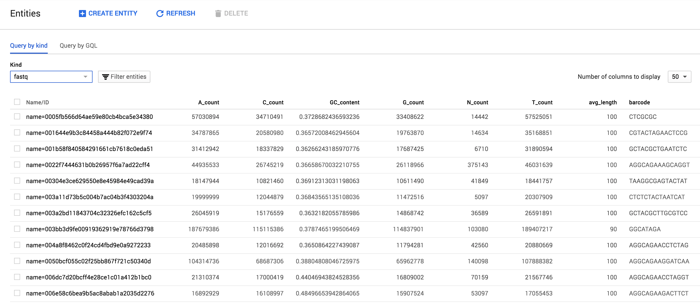

# fastq-profiler

__fastq-profiler__ is a command line utility for keeping track of fastqs and process and store information associated with them. `fastq-profiler` generates summary statistics from processed fastq files and stores the data using the files md5sum as an identifier in [Google Datastore](https://cloud.google.com/datastore/).

I chose Google Datastore because it is centralized - allowing you to profile fastqs locally, or within cluster environments and elsewhere in parallel without having to track/combine files. `fastq-profiler` also integrates with [FastQC](http://www.bioinformatics.babraham.ac.uk/projects/fastqc/) and can be used to output fastq statistics for analysis. Importantly, when duplicates are identified, fastq-profiler keeps track of both locations, allowing you to identify manage duplicate files if necessary.

### Installation

```
pip install https://github.com/danielecook/fastq-profiler/archive/v0.0.4.tar.gz
```

### Setup

* Setup an account with google cloud.
* Authorize Google Cloud using the [gcloud SDK](https://cloud.google.com/sdk/):

```
gcloud auth login
```

* Set your project and default Google Datastore "kind" using:

```
fq set <project> <kind>
```

### Data

__fastq-profiler__ generates a hash of every fastq submitted and uses it to track and store data about fastqs. The end result looks like this within the browsable Google Datastore interface:



The following pieces of information about fastqs (properties) are stored:

__Array Elements__

The three properties below are stored as arrays. Elements within those arrays correspond with one another (e.g. [1,2] ~ [A,B])

* `hostname` - Hostname
* `basename` Fastq basename
* `filename` - Absolute path of Fastq (in every location identified)

__Singlular properties__

* `md5sum` Hash of the file
* `locations_count` - Count of identified locations.
* `date_created` Earliest identified date created
* `flowcell_lane` Flowcell lane
* `filesize` - Filesize in bytes
* `hfilesize` - Filesize in human readable form
* `total_reads` - Read count
* `[ATCGN]_count` - Base counts
* `GC_content` - GC content
* `min_length` - Minimum read length
* `avg_length` - Average read length
* `max_length` - maximum read length

__Additional fields included if applicable__

* `instrument` Instrument name if available
* `flowcell_lane` 
* `flowcell_number`
* `run_id`
* `pair` 1/2 for paired end sequencing.
* `barcode` Index/barcode of read for pooled sequencing
* `control_bits` 

__Illumina Filename__

If the filename follows the [Illumina filename conventions](http://support.illumina.com/content/dam/illumina-support/help/BaseSpaceHelp_v2/Content/Vault/Informatics/Sequencing_Analysis/BS/swSEQ_mBS_FASTQFiles.htm), these items will be parsed out as well:

* `illumina_filename_sample`
* `illumina_filename_barcode_sequence` OR `illumina_filename_sample_number`
* `illumina_filename_lane`
* `illumina_filename_read`
* `illumina_filename_set_number`

_For example:_

`EA-CFB-2-421_S1_L001_R1_001.fastq.gz` would be parsed into:

* `illumina_filename_sample` = EA-CFB-2-421
* `illumina_filename_sample_number` = S1
* `illumina_filename_lane` = L001
* `illumina_filename_read` =  R1
* `illumina_filename_set_number` 1

`fq profile` creates a .checksum file in every directory containing fastqs that it is run on. The `.checksum` file is used as a cache of file hashes to make retrieval of data easier and help with file tracking.

__FastQC Stats__

`fastq-profiler` can optionally store [FastQC](http://www.bioinformatics.babraham.ac.uk/projects/fastqc/) results in datastore as well, and these results can be output as one file, enabling easy aggregation of fastqc results. To incorporate FastQC data, be sure to use the `--fastqc` flag:

```
fq profile --fastqc <fq>
```

`fastqc-profiler` will store the following data in Google Datastore as unindexed properties:

* per_base_sequence_quality
* per_tile_sequence_quality
* per_sequence_quality_scores
* per_base_sequence_content
* per_sequence_gc_content
* per_base_n_content
* sequence_length_distribution
* sequence_duplication_levels
* overrepresented_sequences
* adapter_content
* kmer_content

### Usage

__Set your `project` and `kind`:__

```
fq set <project> <kind>
```

Set `<project>` to your google cloud project name. Set kind to the name of the `kind` you want to store fastq data in within Google Datastore.

```
fq set 'my-google-cloud-project' 'fastq-set'
```

__Profile a fastq__

The `profile` command is designed to be run on any/all fastqs you have, even if they are duplicates. When duplicate files are identified, the path and filenames are both stored under the same entry. However, because they have the same file hash, `fastq-profiler` does not repeat profiling or fastqc operations.

```
fq profile [options] <fq>...
```

__Run fq profile on multiple fastqs__

```
fq profile myseq1.fq.gz myseq2.fq.gz myseq3.fq.gz
```

__Run fq profile on an entire directory__

You can use a `*` wildcard:

```
fq profile *.fq.gz
```

__Read files from stdin__

```
find . -name *.gz  | egrep "(fastq|fq)" - | fq profile - 
```

#### Storing Additional Data

##### Using `.description`

The `.description` file is intended to specify data that should be attached to every fastq within a folder. `.description` files are located in the directory containing fastqs that will be processed. For example:

```
├── 20150505_fastq_files
│   ├── .description
│   ├── sample_001_R01.fq.gz
│   ├── sample_001_R02.fq.gz
|...|
│   ├── sample_300_R01.fq.gz
│   └── sample_300_R02.fq.gz
```

The format of the `description` file is key, value pairs separated by a `:`. For example:

```
species: C. elegans
source: ftp_site
sequencing_center: UChicago
seq_folder: 150406_D00422_0191_BHBDWCADXX-EA-CB12
sequencing_type: DNA
date_submitted: date-2015-03-05
date_sequenced: date-2015-04-06
lab: Andersen Lab
description: DNA sequencing of new wild isolates!
```

Every datastore entity corresponding to a fastq in the folder will have these data attached when you run `fq profile`. 

##### Using .fqdata

If you want to store data specific to the fastq file, for the sequencing library or other properties, you can use a `.fqdata` file. The `.fqdata` file functions similar to the `description` file except that you must specify the fastq using its basename (e.g. /fq_set/myfastq.fq.gz would be myfastq.fq.gz) or md5sum hash.

By the way, you can use both `.description` and `.fqdata` files!

```
├── 20150505_fastq_files
│   ├── .fqdata
│   ├── .description
│   ├── sample_001_R01.fq.gz
│   ├── sample_001_R02.fq.gz
|...|
│   ├── sample_300_R01.fq.gz
│   └── sample_300_R02.fq.gz
```

The `.fqdata` file is tab-separated. For example:

```
#file	Library prepared_by dna_prep_kit
sample_001_R01.fq.gz	LIB1	Robyn	A
sample_001_R02.fq.gz	LIB2	Robyn	B
sample_002_R01.fq.gz	LIB3	Mostafa	C
…           
```

The table looks like this:

| file                 | Library   | prepared_by   | dna_prep_kit   |
|:---------------------|:----------|:--------------|:---------------|
| sample_001_R01.fq.gz | LIB1      | Robyn         | A              |
| sample_001_R02.fq.gz | LIB2      | Robyn         | B              |
| sample_002_R01.fq.gz | LIB3      | Mostafa       | C              |
| ... | ...      | ...       | ...              |


##### Specifying Dates when storing data

To specify dates use the `date-` prefix and use YYYY-MM-DD. For example, `date-2015-03-05`.

#### Fetching fastq data

Once you have profiled fastqs, you can fetch data associated with them using the `fetch` command:

```
fq profile fetch myseq1.fq.gz myseq2.fq.gz
```

The fetch command omits FastQC data tables stored in Datastore.

__Output__

Output is in JSON format.

```
{
    "A_count": 94645601,
    "C_count": 59898634,
    ...
    "barcode": "GAATCTC",
    "basename": [
        "EA-B07_GAATCTC_L001_R2_001.fastq.gz"
    ],
    "bases": 309854148,
    "basic_statistics": "pass",
    "control_bits": 0,
    "cum_length": 309858000,
    "date_created": "2015-03-02T10:24:08+00:00",
    ...
    "filename": [
        "/Volumes/PortusTutus/Project_EA-DS/Sample_EA-B07/EA-B07_GAATCTC_L001_R2_001.fastq.gz"
    ],
    "filesize": 245108588,
    "filtered": "N",
    "flowcell_id": "HGMN3ADXX",
    "flowcell_lane": 1,
    "fq_profile_count": 1,
    "hfilesize": "233 MiB",
    "hostname": [
        "dancook"
    ],
    ...
    "sequence_length_distribution": "pass",
    "total_reads": "3098580",
    "unique_reads": "2002529"
}
```

#### Dump fastq data

Alternatively, you can dump fastq data stored that is stored in the `kind` you set with `fq set`:

```
fq dump
```

The command above will dump all fastq data in JSON format. Data tables saved by FastQC are ommited.

#### Dump FastQC data

`fastq-profiler` can store FastQC data, enabling easy aggregation of fastqc results. To use, you must profile fastqs with the `--fastqc` flag. For example:

```
fq profile --fastqc <fq>
```

Then, you can output data using:

```
fq fastq-dump <fastqc-group> [<fq>...]
```

Where <fastqc-group> is one of:

* per_base_sequence_quality
* per_tile_sequence_quality
* per_sequence_quality_scores
* per_base_sequence_content
* per_sequence_gc_content
* per_base_n_content
* sequence_length_distribution
* sequence_duplication_levels
* overrepresented_sequences
* adapter_content
* kmer_content

__For example:__

```
fq fastqc-dump per_base_sequence_content *.fq.gz
```

Will output all fastqc data in one file among files matching the `*.fq.gz` wildcard.

__Output__

```
filename    base    G   A   T   C
NIC1_130123_I186_FCC1GJUACXX_L2_CHKPEI13010005_1.fq.gz  1   39.08   25.0    12.36   23.56
NIC1_130123_I186_FCC1GJUACXX_L2_CHKPEI13010005_1.fq.gz  2   15.952184666117065  22.176422093981863  41.13767518549052   20.733718054410552
NIC1_130123_I186_FCC1GJUACXX_L2_CHKPEI13010005_1.fq.gz  3   17.0    28.360000000000003  33.0    21.64
...
t_IndexQX1791_2.fq.gz   84-85   18.82   30.54   32.28   18.360000000000003
t_IndexQX1791_2.fq.gz   86-87   18.58   30.159999999999997  33.18   18.08
t_IndexQX1791_2.fq.gz   88-89   18.44   29.439999999999998  31.96   20.16
t_IndexQX1791_2.fq.gz   90  18.6    30.48   31.28   19.64
```

If you specify a list of fastqs, only fastqc results for those files will be dumped. If you leave `<fq>...` empty, all fastqc data for the `<fastqc-group>` specified will be output under the set `kind`. __Note: If a fastq is duplicated, it will only output the first filename that has been stored.__

__--fastqc-threads__

Use `--fastqc-threads` to speed up fastqc.

```
fq profile --fastqc --fastqc-threads 8 <fq>
```

#### Reading data into R

If you use `fq dump` or `fq fetch` you can import data into R using jsonlite:

```
library(jsonlite)
fromJSON("out.json")
```

#### Additional Options

__--kv=<k:v>__ can be used to store custom data. 

Use the `date-` prefix to store a date. Other data types are automatically inferred. You can alternatively use a `.description` file. 

```
fq profile --kv=date_sequenced:date-20160610,sequencing_center:UChicago *.fq.gz
```


In the example above, a 'date_sequenced' property will be added to the fastq entity in google datastore.

__--verbose__ - Provide additional information on what is going on under the hood.


